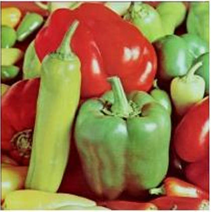
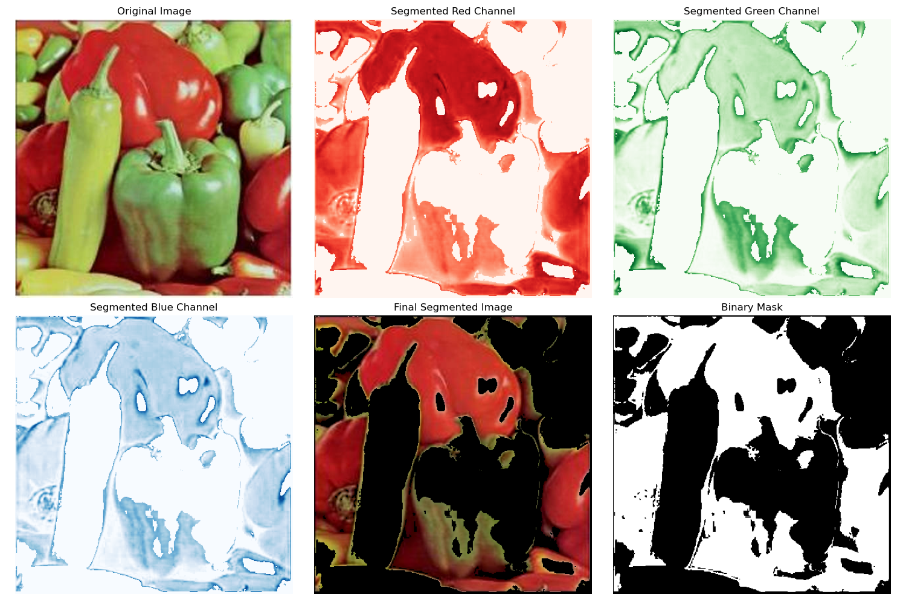

# Red Color Segmentation in an Image

This project demonstrates how to segment red areas in an image using Python with OpenCV and NumPy. The process includes loading an image, applying segmentation in RGB space, and visualizing the results for red, green, blue channels, and the final segmented output.

## Requirements

Ensure the following Python libraries are installed:

- OpenCV
- NumPy
- Matplotlib

Install them using pip:
```bash
pip install opencv-python numpy matplotlib
```

## File Structure

The project assumes the following file structure:
```
project-folder/
  |- image/            # Directory containing input images (e.g., peppers.jpg)
  |- main.py           # Python script for segmentation
  |- main_output.png   # Visualization of segmentation results
```

## Workflow

1. **Read the Image:**
   - Load the input image from the `image/` directory.
   - Convert the image from BGR (default OpenCV format) to RGB for accurate visualization.

2. **Define Target Red Color:**
   - Set the target red color in RGB space (e.g., pure red `[255, 0, 0]`).
   - Calculate the Euclidean distance between the image pixels and the target red.

3. **Create a Mask:**
   - Generate a binary mask where the pixel color matches the target red within a specified threshold.

4. **Segment RGB Channels:**
   - Use the mask to extract red, green, and blue channels.

5. **Combine Channels for Final Image:**
   - Create a segmented image using the extracted channels.

6. **Display and Save Results:**
   - Visualize the original image, segmented R, G, B channels, the binary mask, and the final segmented image using Matplotlib.
   - Save the output visualization as `main_output.png`.

## Running the Code

1. Place the input image (`peppers.jpg`) in the `image/` directory.
2. Run the script:
   ```bash
   python main.py
   ```
3. Outputs:
   - The results will be displayed using Matplotlib.
   - The final visualization will be saved as `main_output.png`.

## Results

### Input


### Output
The results include:

1. **Segmented Red Channel:** Highlights areas identified as red.
2. **Segmented Green Channel:** Corresponding green values for red areas.
3. **Segmented Blue Channel:** Corresponding blue values for red areas.
4. **Binary Mask:** Shows the pixels within the red segmentation threshold.
5. **Final Segmented Image:** Combines the segmented RGB channels.



## Customization

You can modify the segmentation threshold:
```python
threshold = 200
```
- Decrease the threshold to make the segmentation more restrictive.
- Increase the threshold to allow a broader range of red hues.

## License

This project is licensed under the MIT License.

