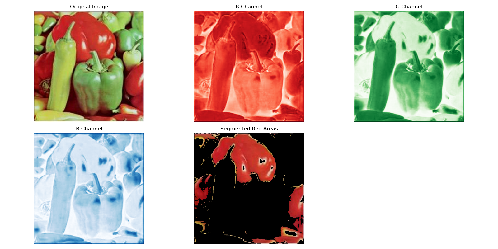

# Red Color Segmentation in an Image

This project demonstrates how to segment red areas in an image using Python and the OpenCV and NumPy libraries. It includes reading an image, separating RGB channels, applying a mask for red segmentation, and visualizing the results.

## Requirements

Make sure you have the following libraries installed in your Python environment:

- OpenCV
- NumPy
- Matplotlib

You can install them using pip:
```bash
pip install opencv-python numpy matplotlib
```

## File Structure

The following file structure is assumed:
```
project-folder/
  |- image/       # Contains input images (e.g., peppers.jpg)
  |- main.py    # The Python script for segmentation
  |- result.png   # Output result after running the script
```

## Code Workflow

1. **Read the Image:**
   - The input image is loaded from the `image/` directory.
   - The image is converted from BGR (default OpenCV format) to RGB for proper visualization.

2. **Split RGB Channels:**
   - The image is separated into its Red (R), Green (G), and Blue (B) channels.

3. **Segment Red Areas:**
   - A mask is created to identify red areas based on the following conditions:
     - The red channel value is greater than 150.
     - The red channel value is at least 10% greater than the green and blue channel values.
   - A new image is generated, retaining only the red areas from the original image.

4. **Display and Save Results:**
   - The original image, R, G, B channels, and the segmented red area image are displayed using Matplotlib.
   - The results are saved to `result.png`.

## Running the Code

1. Place the input image (`peppers.jpg`) inside the `image/` directory.
2. Run the script:
   ```bash
   python main.py
   ```
3. After execution:
   - The results will be displayed in a Matplotlib window.
   - The final result will also be saved as `result.png` in the same directory.

## Output

- **Original Image:** The input image in RGB format.
- **R, G, B Channels:** Visualizations of the red, green, and blue channels, respectively.
- **Segmented Red Areas:** The output image highlighting only the red regions of the input image.

## Example

### Input


### Output
After running the script, the segmented red areas are displayed and saved.

- **R Channel Visualization**
- **Segmented Red Areas**




## Customization

You can adjust the red segmentation threshold in the following line:
```python
red_mask = (R_channel > 150) & (R_channel > G_channel*1.1) & (R_channel > B_channel*1.1)
```
- Increase or decrease `150` to make the segmentation more or less sensitive to red intensity.
- Change the `1.1` factors to adjust how much greater the red channel must be compared to the green and blue channels.

## License

This project is licensed under the MIT License.

